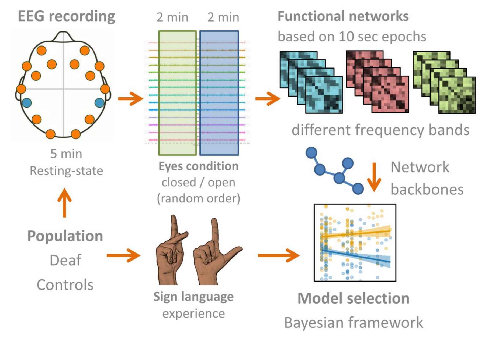
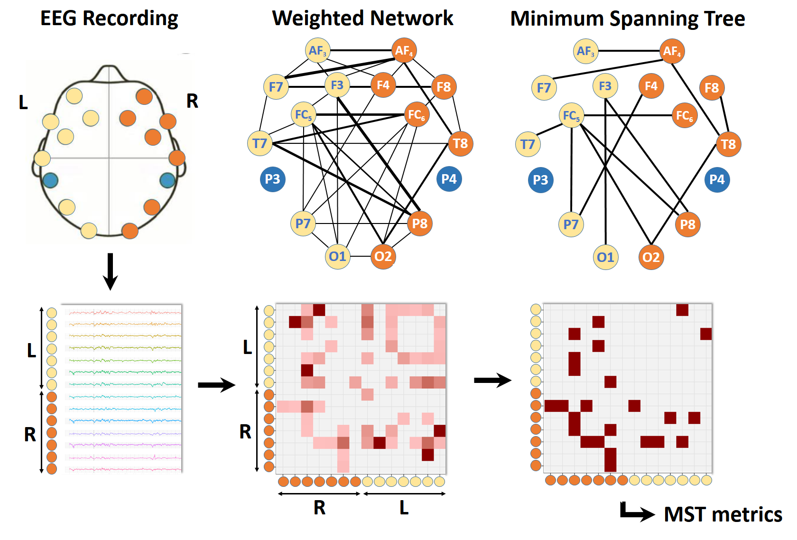

# mst_deaf

Scripts to process functional brain networks, collected in deaf and hearing individuals.

## Background

Prolonged auditory sensory deprivation leads to brain reorganization, indicated by functional enhancement in remaining sensory systems, a phenomenon known as cross-modal plasticity. In this study we investigated differences in functional brain network shifts from eyes-closed to eyes-open conditions between deaf and hearing people.

## Data

Functional brain data is available from the Open Science Framework [project page](https://osf.io/vdpbq).

Electroencephalography activity was recorded in deaf (N = 71) and hearing people (N = 122) living in rural Africa, which yielded a unique data-set of congenital, pre-lingual and post-lingual deaf people, with a divergent experience in American Sign Language. Functional networks were determined from the synchronization of electroencephalography signals between fourteen electrodes distributed over the scalp. We studied the synchronization between the auditory and visual cortex and performed whole-brain minimum spanning tree analysis based on the phase lag index of functional connectivity. 

## Minimum spanning tree

The minimum spanning tree analysis accounts for variations in global network density and allows unbiased characterization of functional network backbones.

* [Background information](https://www.ncbi.nlm.nih.gov/pubmed/29468769) - Research paper on minimum spanning tree.
* [Technical report](https://www.ncbi.nlm.nih.gov/pubmed/25451472) - More technical details on minimum spanning tree.

### Prerequisites

The scripts require R statistical software and the packages igraph, ggplot2 and reshape
* [R](https://www.r-project.org/) - Used to handle words, determine first location and calculate prevalences

## License

This project is licensed - see the [LICENSE](LICENSE) file for details

